## <h1 align="center">Medium</h1>

 

<h4>Medium is an american social publishing platform that is open to all and home to a diverse array of stories, ideas, and perspectives.</h4>

<!-- 
 
 -->

<h1>Team(3 Members)</h1>
<ul color="blue">
<li >Saurabh Kumar Bhardwaj</li>
<li>Mrinal Fouzdar</li>
<li>Jaydeep khatri</li>
</ul>

 

<h1>Tech Stack </h1>
<ul color="blue">
<li>Frontend:HTML,CSS,REACT & Redux</li>
<li>Backend:MongoDb,Express.js & Node.js
<a href="https://github.com/Sk-Bhardwaj24/Medium_Clone_Server"  target="_blank">Backend repository</a>
</li>

<li>Resources used in this project:Material Icons, Chakra UI</li>
</ul>
<h1>Webpages along with its features</h1>

<h2 align="center">Landingpage</h2>
     <h4>We can read the articles posted by different user.</h4>
     <h4>We can see the trending articles.</h4>
     <h4>We are using JSON server for fatching Data</h4>

 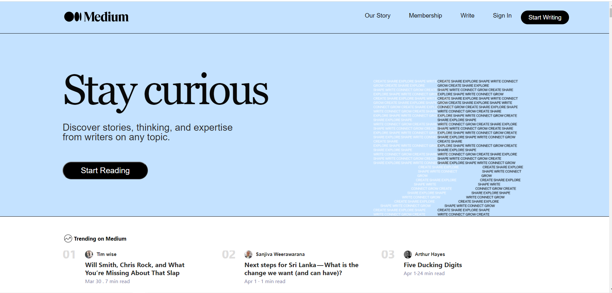

 

<h2 align="center"> Our story</h2>
    <h4>Here user can read about medium.</h4>
    <h4>User can see Trending Author.</h4>
      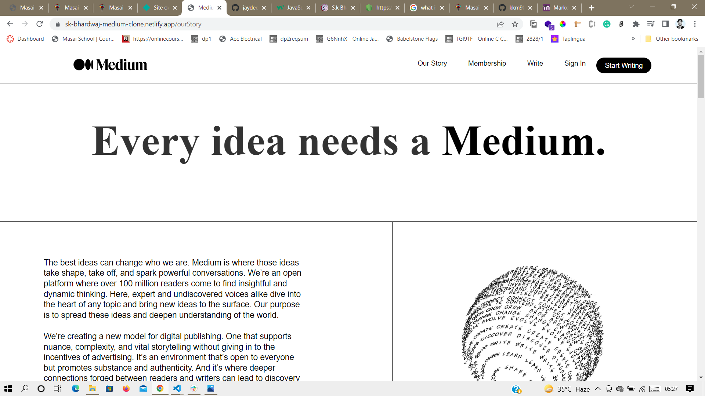
      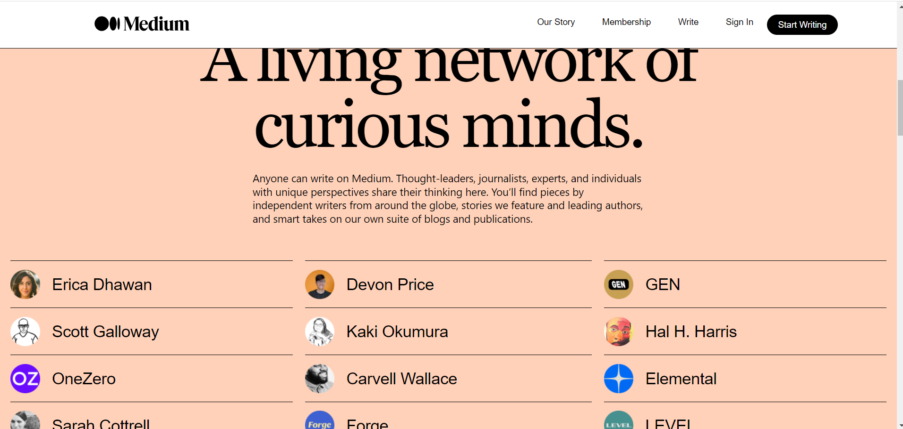
      
 

<h2 align="center">Membership</h2>
   <h4> User can know more about medium and it's membership</h4>

  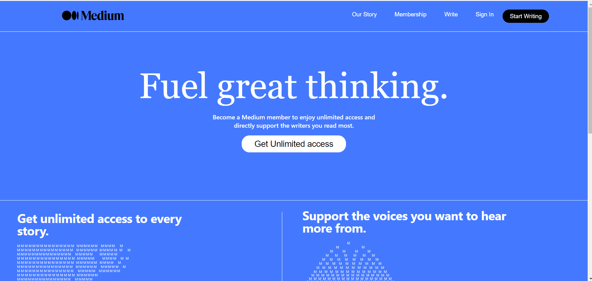
  
 

<h2 align="center">Write</h2>
    <h4>User can know how to start writing</h4>
    <h4> Accordian</h4>
    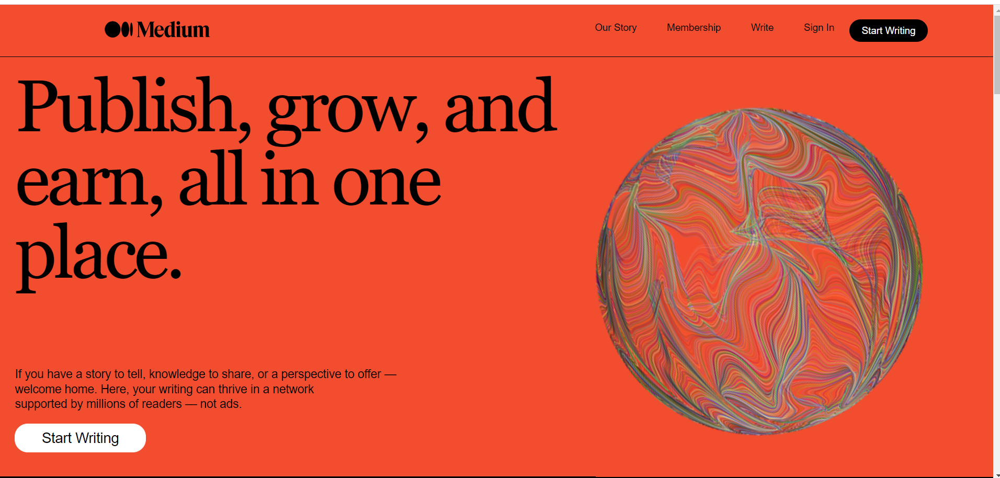
     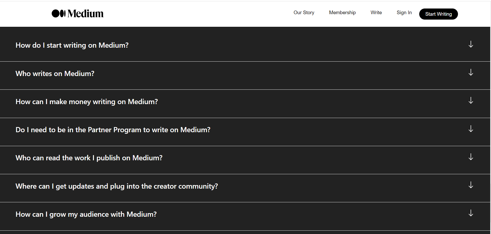
     
 

     
<h2 align="center">Login</h2>
    <h4>User can do login here by gmail</h4>
    <h4> We have used Google OAuth</h4>
    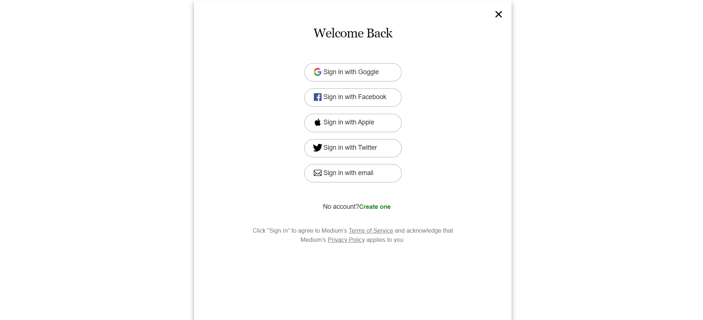
    
 

<h2 align="center">Register</h2>
    <h4>User can register from here by providing email</h4>
   
  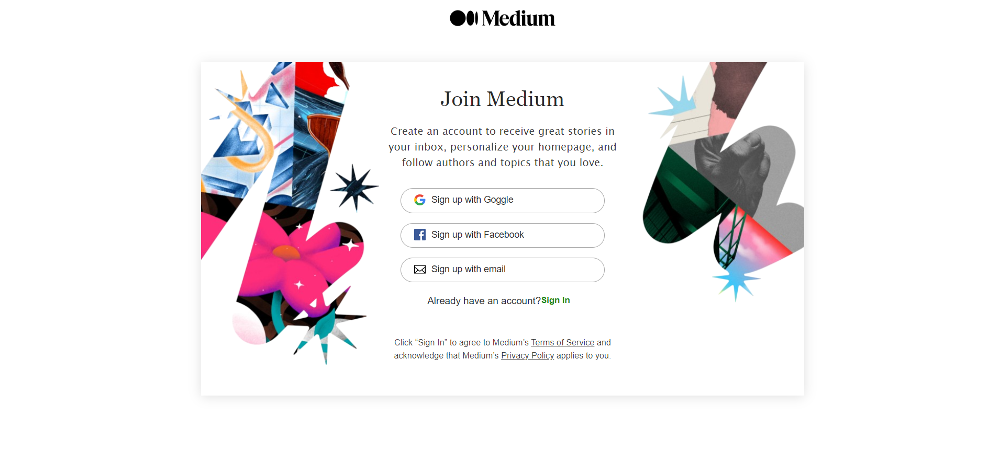
  
 

  
<h2 align="center">Homepage</h2>
    <h4>After Login user will directed to HomePage whey they can read the articles</h4>
   
  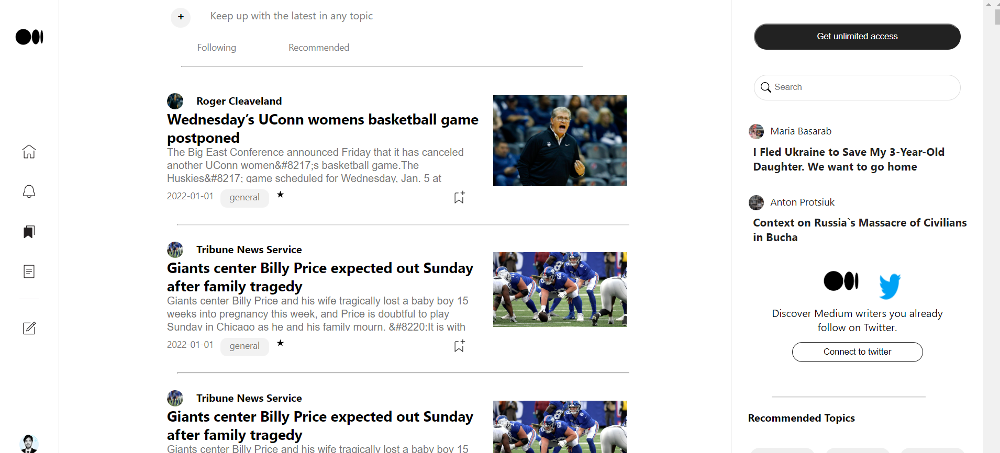
    
 

     
<h2 align="center">Notification</h2>
    <h4>User can get Notification</h4>
   
  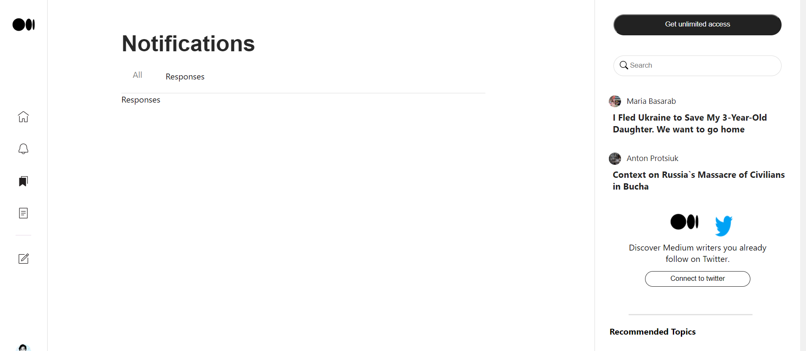
    
 

    
     
<h2 align="center">Publish</h2>
    <h4>You can publish the articles from here</h4>
    <h4>Again we used JSON server for storing the data</h4>
   
  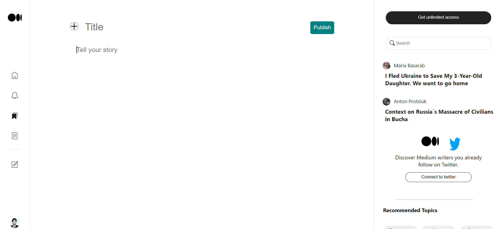
    
 

<h2 align="center">Your stories</h2>
    <h4>You can view all the articles you had published</h4>
    <h4>Also you can delete the article if you want</h4>
   
  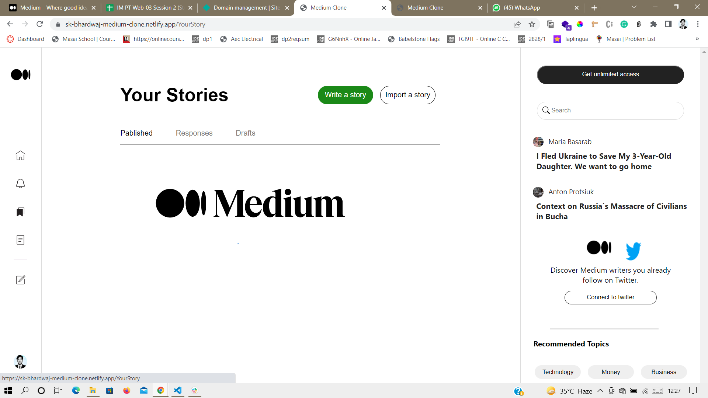
    
 

        
<h2 align="center">Logout</h2>
    <h4>Finally user can Logout </h4>
    <h4>After doing Logout user will redirected to LandingPage</h4>
   
  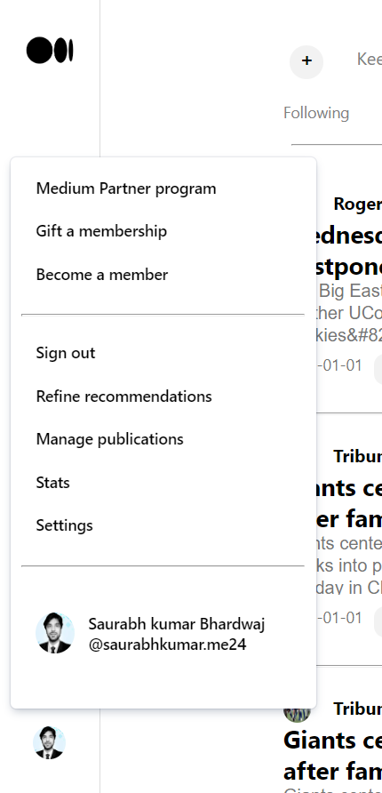
    
 

